**Decision Memo**

**Decision to make:** Extend Fieldbook to North and Islands in Q1.

**Context:** Fieldbook has delivered measurable efficiency and financial returns across four regions, confirming its value to Kestrel's operations. However, rollout delays in South and West revealed critical training bottlenecks and unresolved integration gaps that threaten to erode margins and delay payback in new regions. Early warnings were not scaled, allowing preventable issues to replay across regions.

**Recommendation:** Approve Q1 extension to North and Islands, subject to restructuring onboarding to eliminate training bottlenecks and assigning owners to activate vendor integration solutions.

**Why:**

1.  **Economics favor extension if adoption pace matches Central/East.**
    *   Central and East achieved full adoption within six weeks and paid back running costs within the second quarter; South and West lagged due to training gaps, leaving them at break-even.
    *   Operational gains drive savings: overtime spending is down 12% quarter-over-quarter, and fuel cost per job is down 9%, consistent with an 18% reduction in average travel time.
    *   Technicians completed 5.3 jobs per day versus 4.6 previously, and same-day emergency insertion is now automatic with a median response of 4 minutes.
    *   Extension would add £13,500 monthly in licenses and require winter travel for classroom training; however, the program office estimates favorable economics provided the West pattern of slow adoption is avoided.
    *   Current losses in South and West stem from improvised shadowing arrangements costing an estimated 380 technician-hours of lost route time and a temporary billing clerk costing £8,400; restructuring onboarding eliminates these costs.

2.  **Operational efficiencies justify expansion despite current friction points.**
    *   Dispatcher adoption reached 100% from week one across all regions because the legacy spreadsheet was switched off, forcing immediate transition.
    *   Fieldbook now generates 83% of work orders across live regions, with 412 of 486 technicians having activated accounts.
    *   Friction points are manageable: the parts-ordering screen is unpopular but functions correctly in testing, indicating user habit rather than a defect; dispatchers report no scheduling issues.
    *   Job-completion code mismatches cause the billing team to re-key roughly 300 records weekly, introducing transcription errors; this is a process gap, not a platform failure, and is resolvable via configuration.
    *   Support desk volume peaked in week three and declined steadily, confirming that adoption stabilizes once technicians are onboarded.

3.  **Known system gaps have vendor-ready solutions requiring only internal decisions.**
    *   The asset register feed is missing, hiding equipment history and warranty state; the vendor provides a supported database connector, and IT confirms the integration is straightforward.
    *   The invoicing code mismatch has a vendor-provided configurable mapping table that takes approximately one day to set up; the blocker is the lack of an internal owner, not vendor capability.
    *   Customer-record duplicates arise from exact-postcode search limitations, generating 70 manual merges weekly; the vendor catalogue lists a supported connector to resolve this.
    *   Neither integration was scoped into the rollout program, which was staffed for deployment and training only; activation requires program office authorization and resource assignment.
    *   The vendor relationship remains strong with response times within contract, and both solutions await Kestrel decisions rather than vendor development.

**Risks / Guardrails:**
*   **Onboarding:** Restructure training to provide continuous access (e.g., webinars, self-service modules) so technicians hired after initial sessions are onboarded immediately; monitor adoption weekly to detect lags by week four.
*   **Integrations:** Assign owners for the asset register and invoicing connectors within two weeks; schedule the mapping table setup before North/Islands go-live.
*   **Monitoring:** Track adoption pace against Central/East benchmarks; if North or Islands fall below 80% order creation by week eight, trigger escalation protocol.

```mermaid
flowchart TD
    A["Approve Q1 extension to North and Islands,\nsubject to restructuring onboarding"] --> B1["Economics favor extension\nif adoption pace matches Central/East"]
    A --> B2["Operational efficiencies justify\nexpansion despite current friction points"]
    A --> B3["Known system gaps have vendor-ready\nsolutions requiring only internal decisions"]
    
    B1 --> C11["Central/East paid back costs in Q2;\nSouth/West at break-even due to lag"]
    B1 --> C12["Overtime down 12%; fuel per job down 9%\nvia scheduling density and travel reduction"]
    B1 --> C13["Extension adds £13.5k/month licenses\nand winter travel costs"]
    B1 --> C14["Shadowing and temp clerk costs\nin South/West eliminated by better onboarding"]
    
    B2 --> C21["Jobs per technician rose 4.6 to 5.3;\nemergency insertion median 4 minutes"]
    B2 --> C22["Dispatcher adoption 100% from week one;\nlegacy spreadsheet disabled"]
    B2 --> C23["Parts-ordering dislike is user habit,\nnot a defect"]
    B2 --> C24["Billing re-keying errors resolvable\nvia code mapping configuration"]
    
    B3 --> C31["Asset register connector available;\nIT confirms straightforward implementation"]
    B3 --> C32["Invoicing mapping table exists;\nblocker is lack of internal owner"]
    B3 --> C33["Duplicate record connector available;\nsearch limitation causes 70 merges/week"]
    B3 --> C34["Vendor relationship strong;\nsolutions await Kestrel authorization"]
```

