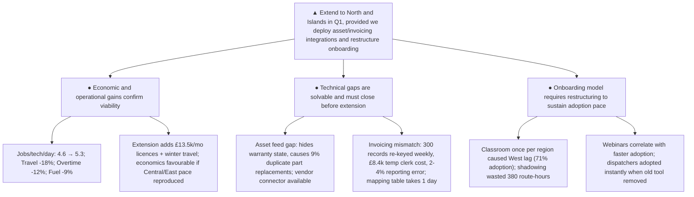

**Subject:** Decision: Extend Fieldbook to North and Islands in Q1

**Situation:** Fieldbook is live in four regions with 83% work-order adoption. Scheduling density rose from 4.6 to 5.3 jobs per technician per day, travel time fell 18%, overtime dropped 12%, and fuel costs fell 9%. Central and East achieved payback within the second quarter; South and West are at break-even.

**Complication:** Two system gaps—missing asset-history feeds and invoicing code mismatches—cause rework, billing errors, and manual reconciliation costing roughly £8,400 per quarter. Onboarding bottlenecks delayed South and West: classroom sessions were too sparse, forcing costly shadowing that pulled experienced technicians off routes. Extending to North and Islands adds £13,500/month in licences and winter travel risk; a repeat of the West pattern would put the new regions underwater for two quarters.

**Question:** Should we extend Fieldbook to North and Islands in Q1?

**Answer:** Yes, extend to North and Islands in Q1, provided we deploy vendor integrations for asset history and invoicing before go-live and restructure onboarding to eliminate training bottlenecks.

---

### 1. Economic and operational gains confirm the model's viability

*   **Productivity and efficiency gains are proven.** Completed jobs per technician per day rose from 4.6 to 5.3 across live regions. Route-aware assignment reduced average travel time between jobs by 18%. Same-day emergency insertion is now automatic with a 4-minute median response, replacing inefficient dispatcher phone chains.
*   **Cost reductions are material.** Overtime spending fell 12% quarter-over-quarter in live regions. Fuel cost per job declined 9%, consistent with travel-time reduction.
*   **Extension economics are favourable if adoption pace holds.** Licence and hosting cost £31,000/month for four regions. Extending to North and Islands adds £13,500/month in licences and requires winter travel for classroom training. The program office estimates the rollout paid back running costs within Q2 in Central and East; South and West are roughly at break-even. The economics of extension are positive provided the faster adoption curve of Central and East can be reproduced.

### 2. Technical gaps are solvable and must be closed before extension

*   **Missing asset-history feed hides warranty state and drives waste.** Fieldbook does not receive service history from the legacy asset register, so technicians open jobs without prior context. In 9% of audited jobs, technicians replaced parts already covered under warranty. The vendor offers a supported database connector; IT confirms the integration is straightforward but was not scoped into the rollout programme.
*   **Invoicing code mismatch forces manual re-keying and creates reporting errors.** Job-completion codes in Fieldbook do not match the invoicing system, requiring the billing team to manually re-key approximately 300 records weekly. This introduced transcription errors caught by customers and forced the addition of one temporary clerk (£8,400 for two quarters). Reporting discrepancies of 2–4% on completed-job counts now require monthly finance reconciliation. The vendor provides a configurable mapping table that takes roughly one day to set up, but no one currently owns the integration.
*   **Vendor solutions are ready pending Kestrel action.** Response times are within contract. Both known system gaps have vendor-side solutions waiting on internal decisions rather than vendor development. Deploying the asset connector and invoicing mapping table resolves these defects.

### 3. Onboarding model requires restructuring to sustain adoption pace

*   **Classroom scarcity created regional lag and hidden costs.** The two-day classroom course was scheduled only once per region. Technicians hired after the session or absent during it learned second-hand. In West, 34 of 118 technicians never attended any session. South took eleven weeks to pass 80% adoption; West remains at 71% after nine weeks. Regional coordinators improvised shadowing arrangements, which worked but consumed an estimated 380 technician-hours of lost route time.
*   **Scalable training correlates with faster adoption.** The support desk runs a weekly one-hour webinar reaching 20–30 technicians; attendance strongly correlates with regions that missed classroom slots. Password resets and login problems account for 44% of tickets, concentrated among technicians who missed the classroom window.
*   **Restructuring onboarding prevents recurrence.** Dispatchers adopted scheduling immediately because the old spreadsheet was switched off on day one, demonstrating that removing alternatives accelerates uptake. To replicate Central and East's six-week full-adoption pace in North and Islands, onboarding must ensure every technician completes formal training before or during go-live, supplemented by webinars for late hires, eliminating reliance on ad-hoc shadowing.

---

**Next step:** Approve Q1 extension to North and Islands and authorise IT to deploy asset-register and invoicing integrations before launch; direct the programme office to redesign onboarding to guarantee universal classroom/webinar coverage for all new-region technicians.

