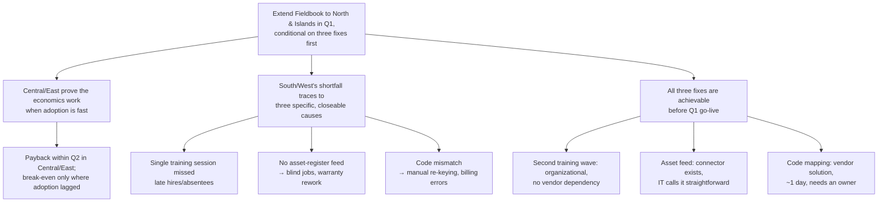

# Fieldbook Rollout — Q1 Extension Decision

**Situation.** Fieldbook has run for two quarters in Central, East, South and West, and you're deciding at the quarterly meeting whether to extend it to North and Islands in Q1.

**Complication.** The four regions split sharply: Central and East paid back Fieldbook's running cost within the second quarter; South and West are only at break-even. Three specific, fixable causes — not the platform — explain that gap.

**Question.** Should we extend Fieldbook to North and Islands in Q1?

**Answer.** **Extend to North and Islands in Q1, conditional on closing three known causes first — not as-is, and not delayed.** Done, the economics reproduce Central/East's payback; done, they risk repeating South/West's two-quarter underwater run.

---

## Options

| | Option | Verdict |
|---|---|---|
| A | Extend now, unchanged process | Repeats the West pattern: same single-session training, same unscoped integrations. Two quarters underwater on current evidence. |
| B | Delay to Q2/Q3 until fixed | Forfeits schedule for no reason — all three fixes are small and already offered by the vendor/IT, not multi-quarter projects. |
| **C** | **Extend in Q1, conditional on three fixes completed first** | **Recommended** — achievable before go-live, and reproduces the fast-adoption economics. |

## Why C: the three causes, and why each is closeable before Q1

1. **Training reached technicians once, not all of them.** A single classroom session per region left late hires and absentees to learn secondhand — this is what slowed South (11 weeks to 80%) and West (still 71%, 34 of 118 never trained), drove 44% of all support tickets, and forced the shadowing that cost 380 technician-hours. Fix: schedule a second wave (or staggered onboarding) before North/Islands go live — an organizational change, not a platform one.
2. **Fieldbook never received equipment history from the asset register.** Technicians work blind, which caused 9% of audited jobs to replace already-warrantied parts and left the audit trail empty for disputes. IT calls the connector straightforward; it was simply never scoped. Fix: commission the nightly export before go-live.
3. **Completion codes don't match the invoicing system.** This forces ~300 manual re-keys a week, produces the billing errors customers catch, and causes the 2–4% weekly gap between Fieldbook and invoicing job counts. The vendor's mapping table takes about a day to configure; it only needs an owner on Kestrel's side. Fix: assign that owner now.

(A fourth, minor defect — duplicate customer records from postcode-only search — costs ~70 manual merges a week but doesn't materially affect payback; worth fixing but not a go/no-go condition.)

## Guardrail

Every South/West symptom was visible in Central by week four; the program had no mechanism to act on it early, so it repeated in each region. For North and Islands, track week-4 adoption against the Central/East curve as an explicit checkpoint — if it tracks West instead, halt further spend and revisit before Islands follows North.

## Next step

Approve extension at the quarterly meeting on the condition above; program office closes the three fixes before North training begins.

---

