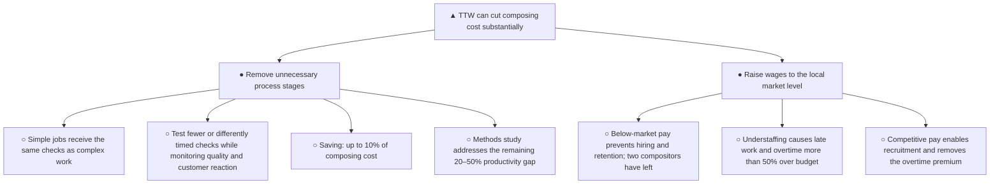
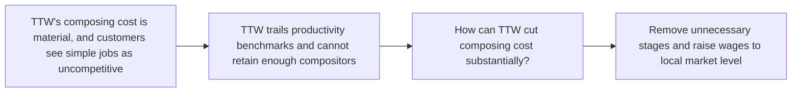

```mermaid
flowchart TD
    A["▲ TTW can cut composing cost substantially"] --> B1["● Remove unnecessary process stages"]
    A --> B2["● Raise wages to the local market level"]

    B1 --> C11["○ Simple jobs receive the same checks as complex work"]
    B1 --> C12["○ Test fewer or differently timed checks while monitoring quality and customer reaction"]
    B1 --> C13["○ Saving: up to 10% of composing cost"]
    B1 --> C14["○ Methods study addresses the remaining 20–50% productivity gap"]

    B2 --> C21["○ Below-market pay prevents hiring and retention; two compositors have left"]
    B2 --> C22["○ Understaffing causes late work and overtime more than 50% over budget"]
    B2 --> C23["○ Competitive pay enables recruitment and removes the overtime premium"]
```

```mermaid
flowchart LR
    S["TTW's composing cost is material, and customers see simple jobs as uncompetitive"] --> C["TTW trails productivity benchmarks and cannot retain enough compositors"]
    C --> Q["How can TTW cut composing cost substantially?"]
    Q --> A["Remove unnecessary stages and raise wages to local market level"]
```