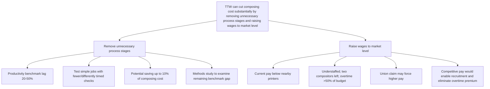

```mermaid
flowchart TD
    A["TTW can cut composing cost substantially by removing unnecessary process stages and raising wages to market level"] --> B["Remove unnecessary process stages"]
    A --> C["Raise wages to market level"]
    B --> B1["Productivity benchmark lag 20‑50%"]
    B --> B2["Test simple jobs with fewer/differently timed checks"]
    B --> B3["Potential saving up to 10% of composing cost"]
    B --> B4["Methods study to examine remaining benchmark gap"]
    C --> C1["Current pay below nearby printers"]
    C --> C2["Understaffed; two compositors left; overtime >50% of budget"]
    C --> C3["Union claim may force higher pay"]
    C --> C4["Competitive pay would enable recruitment and eliminate overtime premium"]
```
