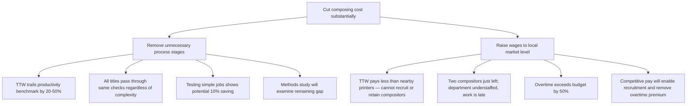
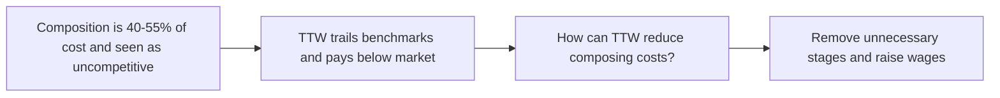

```mermaid
flowchart TD
    A["Cut composing cost substantially"] --> B1["Remove unnecessary process stages"]
    A --> B2["Raise wages to local market level"]
    
    B1 --> C11["TTW trails productivity benchmark by 20-50%"]
    B1 --> C12["All titles pass through same checks regardless of complexity"]
    B1 --> C13["Testing simple jobs shows potential 10% saving"]
    B1 --> C14["Methods study will examine remaining gap"]
    
    B2 --> C21["TTW pays less than nearby printers — cannot recruit or retain compositors"]
    B2 --> C22["Two compositors just left; department understaffed, work is late"]
    B2 --> C23["Overtime exceeds budget by 50%"]
    B2 --> C24["Competitive pay will enable recruitment and remove overtime premium"]
```

```mermaid
flowchart LR
    S["Composition is 40-55% of cost and seen as uncompetitive"] --> C["TTW trails benchmarks and pays below market"]
    C --> Q["How can TTW reduce composing costs?"]
    Q --> A["Remove unnecessary stages and raise wages"]
```
