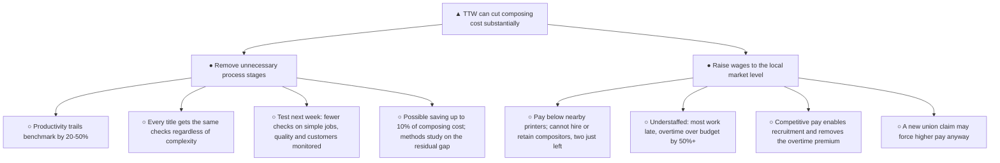
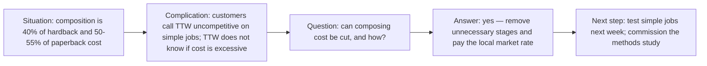

**Legend:** `▲` top · `●` first-level group · `○` support · `⊕` gap

| Node | Note |
|---|---|
| First level | Two groups, not three or four — acceptable here: both are actions, non-overlapping (process vs. staffing), and together cover the cost base |
| `● Raise wages` | ⊕ no size of saving quantified, unlike the 10% under the first branch |
| `▲ Top` | "substantially" is quantified only for one of the two branches |
