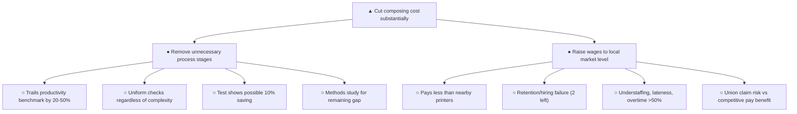

```mermaid
flowchart TD
    Top["▲ Cut composing cost substantially"] --> B1["● Remove unnecessary process stages"]
    Top --> B2["● Raise wages to local market level"]
    
    B1 --> C11["○ Trails productivity benchmark by 20-50%"]
    B1 --> C12["○ Uniform checks regardless of complexity"]
    B1 --> C13["○ Test shows possible 10% saving"]
    B1 --> C14["○ Methods study for remaining gap"]
    
    B2 --> C21["○ Pays less than nearby printers"]
    B2 --> C22["○ Retention/hiring failure (2 left)"]
    B2 --> C23["○ Understaffing, lateness, overtime >50%"]
    B2 --> C24["○ Union claim risk vs competitive pay benefit"]
```
