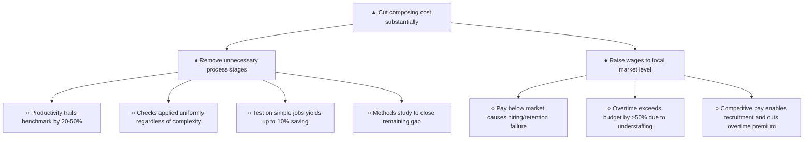
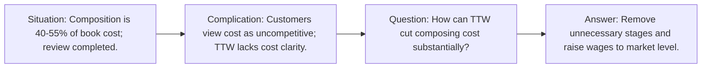

```mermaid
flowchart TD
    A["▲ Cut composing cost substantially"] --> B1["● Remove unnecessary process stages"]
    A --> B2["● Raise wages to local market level"]
    
    B1 --> C11["○ Productivity trails benchmark by 20-50%"]
    B1 --> C12["○ Checks applied uniformly regardless of complexity"]
    B1 --> C13["○ Test on simple jobs yields up to 10% saving"]
    B1 --> C14["○ Methods study to close remaining gap"]
    
    B2 --> C21["○ Pay below market causes hiring/retention failure"]
    B2 --> C22["○ Overtime exceeds budget by >50% due to understaffing"]
    B2 --> C23["○ Competitive pay enables recruitment and cuts overtime premium"]
```

```mermaid
flowchart LR
    S["Situation: Composition is 40-55% of book cost; review completed."] --> C["Complication: Customers view cost as uncompetitive; TTW lacks cost clarity."]
    C --> Q["Question: How can TTW cut composing cost substantially?"]
    Q --> A["Answer: Remove unnecessary stages and raise wages to market level."]
```
