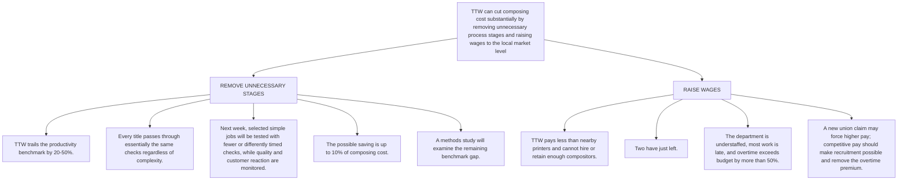

```mermaid
flowchart TD
    Key["TTW can cut composing cost substantially by removing unnecessary process stages and raising wages to the local market level"]

    Key --> Stages["REMOVE UNNECESSARY STAGES"]
    Key --> Wages["RAISE WAGES"]

    Stages --> S1["TTW trails the productivity benchmark by 20-50%."]
    Stages --> S2["Every title passes through essentially the same checks regardless of complexity."]
    Stages --> S3["Next week, selected simple jobs will be tested with fewer or differently timed checks, while quality and customer reaction are monitored."]
    Stages --> S4["The possible saving is up to 10% of composing cost."]
    Stages --> S5["A methods study will examine the remaining benchmark gap."]

    Wages --> W1["TTW pays less than nearby printers and cannot hire or retain enough compositors."]
    Wages --> W2["Two have just left."]
    Wages --> W3["The department is understaffed, most work is late, and overtime exceeds budget by more than 50%."]
    Wages --> W4["A new union claim may force higher pay; competitive pay should make recruitment possible and remove the overtime premium."]
```
