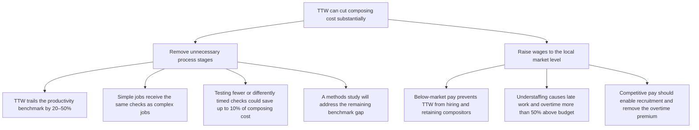
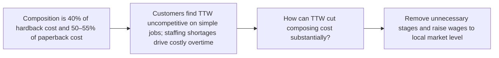

| Gap / uncertainty | Where it sits |
|---|---|
| ⊕ Total savings from raising wages are not quantified | Raise wages |
| ⊕ The actions needed to close the remaining productivity gap are not yet known | Methods study |