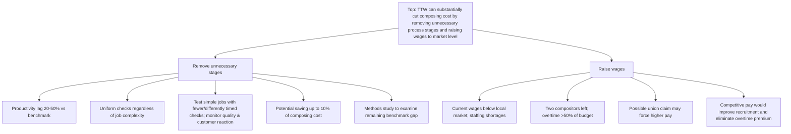

```mermaid
flowchart TD
    A["Top: TTW can substantially cut composing cost by removing unnecessary process stages and raising wages to market level"] --> B1["Remove unnecessary stages"]
    A --> B2["Raise wages"]

    B1 --> C11["Productivity lag 20‑50% vs benchmark"]
    B1 --> C12["Uniform checks regardless of job complexity"]
    B1 --> C13["Test simple jobs with fewer/differently timed checks; monitor quality & customer reaction"]
    B1 --> C14["Potential saving up to 10% of composing cost"]
    B1 --> C15["Methods study to examine remaining benchmark gap"]

    B2 --> C21["Current wages below local market; staffing shortages"]
    B2 --> C22["Two compositors left; overtime >50% of budget"]
    B2 --> C23["Possible union claim may force higher pay"]
    B2 --> C24["Competitive pay would improve recruitment and eliminate overtime premium"]
```
