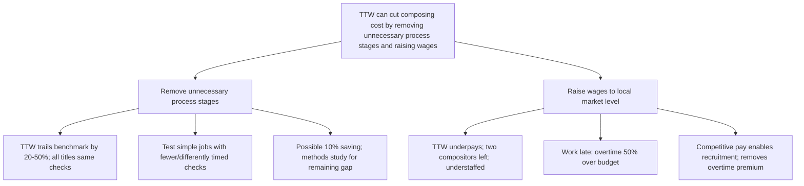

```text
Top: TTW can cut composing cost substantially by removing unnecessary process stages and raising wages to the local market level.

1. Remove unnecessary process stages
   - TTW trails productivity benchmark by 20-50%
   - Every title passes through same checks regardless of complexity
   - Simple jobs will be tested with fewer/differently timed checks
   - Possible saving: 10% of composing cost
   - Methods study will examine remaining benchmark gap

2. Raise wages to local market level
   - TTW pays less than nearby printers; cannot retain compositors
   - Two compositors just left; department understaffed
   - Most work is late; overtime exceeds budget by 50%+
   - Competitive pay will enable recruitment and remove overtime premium
```


