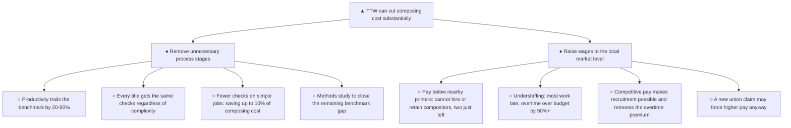
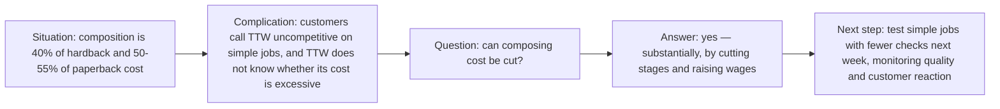

**Pyramid**

**SCQ ribbon**

**Structure**

- Top: one sentence, answers the reader's question, states a payoff.
- Two first-level groups, same kind (actions), ordered by ranking — the tested, quantified action first.
- Supports: within each branch, evidence of the problem → the action → its payoff.
