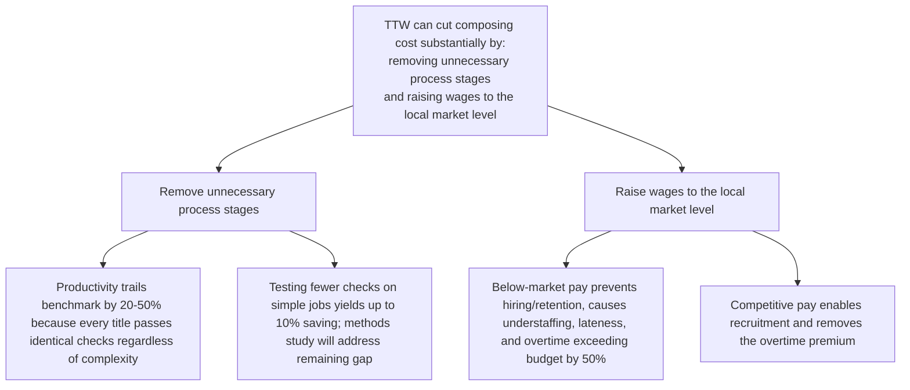
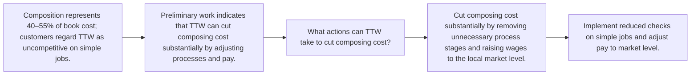

```mermaid
flowchart TD
    A["TTW can cut composing cost substantially by:\nremoving unnecessary process stages\nand raising wages to the local market level"] --> B1["Remove unnecessary process stages"]
    A --> B2["Raise wages to the local market level"]
    
    B1 --> C11["Productivity trails benchmark by 20-50% because every title passes identical checks regardless of complexity"]
    B1 --> C12["Testing fewer checks on simple jobs yields up to 10% saving; methods study will address remaining gap"]
    
    B2 --> C21["Below-market pay prevents hiring/retention, causes understaffing, lateness, and overtime exceeding budget by 50%"]
    B2 --> C22["Competitive pay enables recruitment and removes the overtime premium"]
```

```mermaid
flowchart LR
    S["Composition represents 40–55% of book cost; customers regard TTW as uncompetitive on simple jobs."] --> C["Preliminary work indicates that TTW can cut composing cost substantially by adjusting processes and pay."]
    C --> Q["What actions can TTW take to cut composing cost?"]
    Q --> A["Cut composing cost substantially by removing unnecessary process stages and raising wages to the local market level."]
    A --> N["Implement reduced checks on simple jobs and adjust pay to market level."]
```
