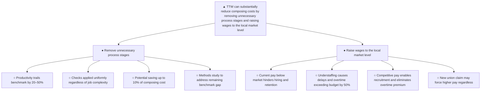
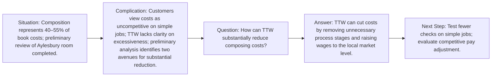

```mermaid
flowchart TD
    A["▲ TTW can substantially reduce composing costs by removing unnecessary process stages and raising wages to the local market level"]
    
    A --> B1["● Remove unnecessary process stages"]
    A --> B2["● Raise wages to the local market level"]
    
    B1 --> C11["○ Productivity trails benchmark by 20–50%"]
    B1 --> C12["○ Checks applied uniformly regardless of job complexity"]
    B1 --> C13["○ Potential saving up to 10% of composing cost"]
    B1 --> C14["○ Methods study to address remaining benchmark gap"]
    
    B2 --> C21["○ Current pay below market hinders hiring and retention"]
    B2 --> C22["○ Understaffing causes delays and overtime exceeding budget by 50%"]
    B2 --> C23["○ Competitive pay enables recruitment and eliminates overtime premium"]
    B2 --> C24["○ New union claim may force higher pay regardless"]
```

```mermaid
flowchart LR
    S["Situation: Composition represents 40–55% of book costs; preliminary review of Aylesbury room completed."] --> C["Complication: Customers view costs as uncompetitive on simple jobs; TTW lacks clarity on excessiveness; preliminary analysis identifies two avenues for substantial reduction."]
    C --> Q["Question: How can TTW substantially reduce composing costs?"]
    Q --> A["Answer: TTW can cut costs by removing unnecessary process stages and raising wages to the local market level."]
    A --> N["Next Step: Test fewer checks on simple jobs; evaluate competitive pay adjustment."]
```
