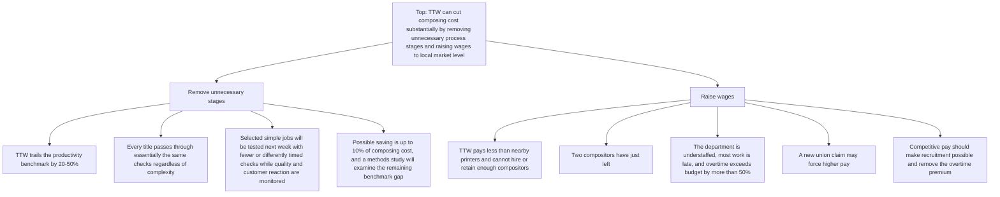

```mermaid
flowchart TD
    A["Top: TTW can cut composing cost substantially by removing unnecessary process stages and raising wages to local market level"] --> B1["Remove unnecessary stages"]
    A --> B2["Raise wages"]

    B1 --> C11["TTW trails the productivity benchmark by 20-50%"]
    B1 --> C12["Every title passes through essentially the same checks regardless of complexity"]
    B1 --> C13["Selected simple jobs will be tested next week with fewer or differently timed checks while quality and customer reaction are monitored"]
    B1 --> C14["Possible saving is up to 10% of composing cost, and a methods study will examine the remaining benchmark gap"]

    B2 --> C21["TTW pays less than nearby printers and cannot hire or retain enough compositors"]
    B2 --> C22["Two compositors have just left"]
    B2 --> C23["The department is understaffed, most work is late, and overtime exceeds budget by more than 50%"]
    B2 --> C24["A new union claim may force higher pay"]
    B2 --> C25["Competitive pay should make recruitment possible and remove the overtime premium"]
```
