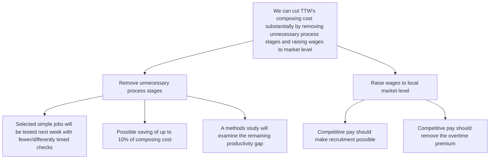
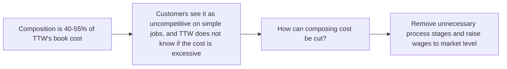

```text
Top: TTW can cut composing cost substantially by removing unnecessary process stages and raising wages to the local market level
  1. Remove unnecessary process stages
     - Test selected simple jobs next week with fewer/differently timed checks
     - Possible saving of up to 10% of composing cost
     - Methods study to examine remaining productivity gap
  2. Raise wages to local market level
     - Competitive pay should make recruitment possible
     - Competitive pay should remove the overtime premium
```


