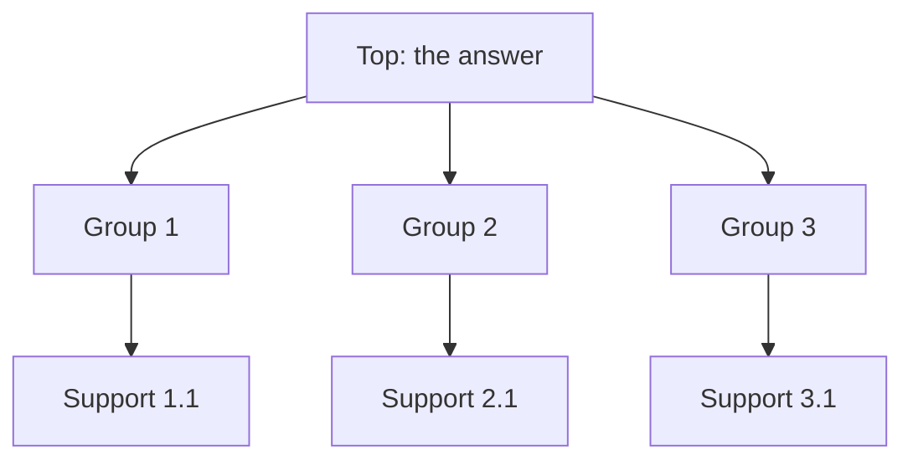
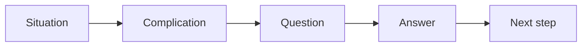

# Render templates

Skeletons only. Translate the labels into the output language, keep the order.
Drop a section rather than filling it with filler; say which section you dropped.

## Email / message

```text
Subject: <the answer in one line>

Situation:   <what the reader already knows and will agree with>
Complication:<what changed, what blocks, why a choice is needed now>
Answer:      <what you propose or assert>

Why:
1. <reason 1>
2. <reason 2>
3. <reason 3>

What I need now: <decision / sign-off / comment, by when>
```

The labels are a drafting skeleton, not the required output. For a reader who was not in
the room, deliver the same Situation → Complication as running prose; for a reader who
commissioned the document, the request itself is the Situation and one clause covers it.

For a chat message compress to three lines: answer, two strongest reasons, the ask.
No SCQ ceremony in Slack.

## Decision memo

```text
Decision to make: <one sentence>
Context:          <2–3 lines: situation + complication>
Options:          A. … B. … C. …
Criteria:         <3–4 comparison criteria, the same for every option>
Recommendation:   <which one and why>
Risks / guardrails: <what would make this wrong, and what limits it>
```

The options must be same-kind and non-overlapping, and the criteria must be applied
to all of them — one criterion silently used on one option only is the classic defect
here.

## Deck storyline

```text
Slide 1  Executive answer — self-sufficient, readable alone
Slide 2  Why this is a question now (situation + complication)
Slide 3  Argument 1
Slide 4  Argument 2
Slide 5  Argument 3
Slide 6+ Backup: data, calculations, risks, next steps
```

Backup slides support; they never repeat the argument slides.

## One-pager for sign-off

```text
▲ <top: the decision>

● <branch 1>   owner · metric · date
● <branch 2>   owner · metric · date
● <branch 3>   owner · metric · date

Next step: <what happens after approval, and who moves>
```

## Mermaid — pyramid



Keep it to two levels below the top. Label every node with a claim, not a topic
word. Mark a broken branch in the label itself (`"⚠ Group 3 — mixed kinds"`); node
styling is not worth the noise.

## Mermaid — SCQ ribbon



## HTML artifact brief

Only on an explicit request for a page or an interactive/shareable view. Create a
self-contained file in the current workspace. Publish it only when the current host
has a suitable publishing capability; otherwise return the local file.

Show:

- the pyramid by levels, top prominent, groups collapsible to their supports;
- violations highlighted in place, with the marker legend visible;
- a findings panel: what is broken, where, how to fix;
- the score with its band.

Do not: external CDN, remote fonts or images, horizontal page scroll (wide diagrams
scroll inside their own container), light-only styling, a favicon that changes
between redeploys.
